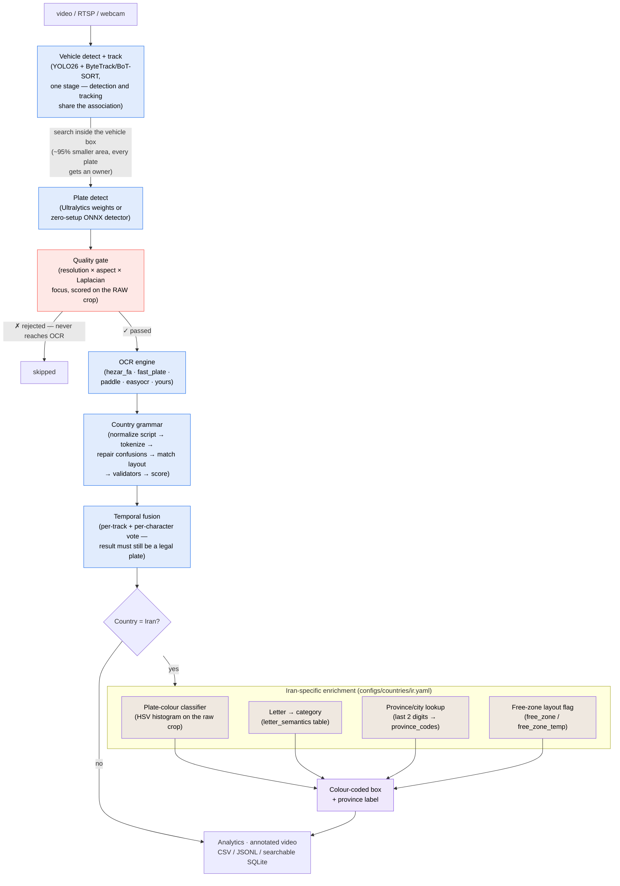

<div align="center">

# 🚗 PelakX

**Multilingual License Plate Intelligence — Read. Validate. Understand.**

Turn any traffic camera into searchable, multilingual traffic intelligence.
Detect vehicles, track them, read their plates **in the right script**, and check
every reading against the country's *real* plate grammar before believing it.

*پلتفرم هوشمند تشخیص و تحلیل پلاک خودرو — چندزبانه، بلادرنگ، ماژولار*

[]()
[]()
[]()
[]()
[]()
[]()

</div>

---

## The problem with every other open-source ALPR

They stop at `YOLO → OCR → print(text)`.

That pipeline hands you a *different string every frame*, has no idea whether the
string it just produced could even be a real plate, and only works for the one
country its author lives in.

PelakX adds the three layers that turn OCR output into information:

```
                    OCR says:  "12ب345I1"
                                   │
   ①  COUNTRY GRAMMAR  ────────────┤  Iran layout is DD-L-DDD-DD.
      Slot 6 must be a digit; "I" is not.                     ↓
      Confusion map repairs I→1 at a 6% confidence cost.   12ب34511  ✓ valid
                                   │
   ②  TEMPORAL FUSION  ────────────┤  frame 41: 12ب34511   frame 44: 12ب34521
      Weighted per-character vote     frame 47: 12ب34511   frame 52: 12ب94511
      across the whole tracklet.                            ↓
                                                   12ب34511  (97%, 4 votes)
                                   │
   ③  ANALYTICS  ──────────────────┤  speed · direction · line crossings ·
                                      watchlist · searchable SQLite
```

Layer ① is why a plate that *no single frame read correctly* still comes out right.

---

## 60-second quickstart

```bash
git clone https://github.com/ParsaVictor/PelakX.git
cd PelakX
pip install -e ".[detect,onnx]"     # add ",fa" for Persian, ",dash" for the dashboard
```

**See the grammar engine work with no models and no video:**

```bash
pelakx parse "۱۲ ب ۳۴۵ ایران ۱۱"
```

```
┌───────────────── input: ۱۲ ب ۳۴۵ ایران ۱۱ ─────────────────┐
│ 12 ب 345 | ایران 11                                        │
│                                                            │
│ canonical   12ب34511                                       │
│ country     IR   layout: civilian                          │
│ confidence  92.0%   (ocr 90%, 0 repairs)                   │
│ status      valid                                          │
│                                                            │
│ fields                                                     │
│   left       12                                            │
│   letter     ب        right      345                       │
│   province   11                                            │
└────────────────────────────────────────────────────────────┘
```

Persian-Indic digits folded, the printed word **ایران** stripped, the layout
matched, the province validated — all from a YAML file.

**Then run it on video:**

```bash
pelakx run traffic.mp4 --country IR          # Persian plates
pelakx run traffic.mp4 --country GB          # UK plates
pelakx run traffic.mp4 --country auto        # let PelakX work out the country
pelakx bench traffic.mp4                     # can this machine keep up? where does the time go?
pelakx search "12ب*"                         # query the results afterwards
pelakx dashboard                             # explore them visually
```

Prefer a notebook? [`notebooks/PelakX_Quickstart.ipynb`](notebooks/PelakX_Quickstart.ipynb)
walks through every layer with runnable cells — the first four sections need no
models and no video.

A real run on 131 frames of dashcam footage, **CPU only, no GPU**:

```
 frames processed           131
 throughput             8.2 fps
 vehicles tracked             3
 plate readings               8
 crops skipped by gate   0 (0%)

 track  plate           conf  class
     1  KL 09 AQ 3439    97%  motorcycle       ← country auto-detected as India
```

---

## What makes it different

| | Typical OSS ALPR | **PelakX** |
|---|---|---|
| Vehicle + plate detection | ✅ | ✅ YOLO26, CPU-optimised |
| OCR | one language | ✅ **Persian + Latin + any script**, per-country engine chain |
| Multi-country plate formats | ❌ | ✅ **12 grammars shipped**, add one with a YAML file |
| Believes the OCR blindly | ✅ 😬 | ❌ every read is validated against a real plate grammar |
| Fixes OCR confusions | ❌ | ✅ bounded, priced `O↔0`, `ك↔ک` repair |
| Result per frame or per vehicle | per frame (flickers) | ✅ **per vehicle**, character-level temporal vote |
| Wastes OCR on unreadable crops | ✅ | ❌ quality gate skips them (typically 40–70%) |
| Auto-detect issuing country | ❌ | ✅ `--country auto` across all 12 grammars |
| Speed estimation | pixels/frame 🙃 | ✅ homography-calibrated, or **not reported at all** |
| Right-to-left text on video | mojibake | ✅ reshaped + bidi, real glyphs |
| Privacy mode | ❌ | ✅ one flag: pixelated plates, salted-HMAC pseudonyms |
| Searchable output | CSV | ✅ CSV / JSONL / **SQLite + FTS5 full-text search** |
| Adding a language | fork & rewrite | ✅ a config file, or a ~40-line engine plugin |

---

## Countries shipped

| | | | |
|---|---|---|---|
| 🇮🇷 Iran (3 layouts, Persian) | 🇬🇧 United Kingdom | 🇺🇸 United States | 🇩🇪 Germany |
| 🇫🇷 France | 🇪🇸 Spain | 🇮🇹 Italy | 🇳🇱 Netherlands |
| 🇹🇷 Türkiye | 🇮🇳 India | 🇧🇷 Brazil | 🇦🇪 UAE |

```bash
pelakx countries          # list them
pelakx countries IR       # layouts, letter meanings, engine chain
pelakx new-country PK     # scaffold your own
```

**One country or all of them.** Naming a country is the default and the cheaper
path — only that grammar is consulted. `--country auto` opts every one of the
12 into competing for each reading, and uses the OCR engine's own region guess
only to break ties. Prefer a fixed country whenever you know it: a tighter
alphabet means fewer ways for OCR to be wrong, which is worth more than the
compute it saves.

> Auto runs **one** OCR engine over every crop, so it works within a script
> (Latin plates across Europe), not across them. For a mixed-script site, run
> one pipeline per camera.

Grammars live in `configs/countries/*.yaml` and are also loaded from
`~/.pelakx/countries/` and `$PELAKX_COUNTRIES` — **a country PR touches no Python
at all.** → [docs/ADDING_A_COUNTRY.md](docs/ADDING_A_COUNTRY.md)

---

## Architecture

Two-stage detection (find the vehicle, then look for a plate *inside* it) shrinks
the search area by ~95% and gives every plate an owner, which is what makes the
temporal vote and the Iran-specific enrichment below possible — a bare
`plate-detector → OCR` pipeline has no vehicle to attach any of this to.



**Colour legend used on the annotated output** (see
[`src/pelakx/render/annotate.py`](src/pelakx/render/annotate.py) and
[`src/pelakx/grammar/plate_color.py`](src/pelakx/grammar/plate_color.py) —
every mapping below was checked against a real, photographed Iranian plate,
not guessed; sources cited in `configs/countries/ir.yaml`):

| Plate background / category | Box colour | Meaning |
|---|---|---|
| White | neutral (default) | Private / personal |
| Yellow | 🟧 orange | Taxi / public transport / commercial |
| Red | 🟥 red | Government / protocol |
| Green | 🟩 green | Police |
| Blue | 🟦 blue | Diplomatic / political |
| Brown | 🟫 brown | Historical / vintage (پلاک تاریخی) |
| Free-trade-zone (permanent or temporary) | 🟪 purple | Structurally different layout — flagged regardless of background colour |
| معلولین/جانباز letter slot | 🟦 cyan | Disabled / veteran |

Full write-up: [docs/ARCHITECTURE.md](docs/ARCHITECTURE.md) ·
Model choices and benchmarks: [docs/MODELS.md](docs/MODELS.md)

---

## Models

Everything is swappable; the defaults assume **CPU**, because that is where most
traffic cameras actually run.

| Stage | Default | Why |
|---|---|---|
| Vehicle | `yolo26n.pt` | Native end-to-end (no NMS), ~43% faster CPU ONNX than YOLO11n |
| Plate | `open-image-models` YOLOv9-t 384 end2end (ONNX) | Nothing to download by hand, ~5–10 ms CPU |
| OCR (Persian) | `hezarai/crnn-fa-license-plate-recognition-v2` | CRNN-CTC trained on Iranian plates specifically |
| OCR (Latin) | `fast-plate-ocr` `cct-xs-v2-global-model` | ONNX, ~13 ms CPU, 220k plates / 65+ countries |
| OCR (anything else) | PaddleOCR PP-OCRv5/v6 | One package, most scripts |
| Tracking | ByteTrack (`botsort.yaml` for heavy occlusion) | Identity switches destroy the temporal vote |

```bash
pelakx doctor        # what is installed, what is missing, and the exact fix
pelakx engines       # OCR engines and their availability
```

### Device selection

`device: auto` is the default and resolves at startup — **CUDA → MPS → CPU** —
so one config file runs on a workstation and on a fanless camera box. Override
with `--device cpu` / `--device cuda:1`, or globally with `PELAKX_DEVICE`.
`pelakx doctor` prints what it picked and why.

### Speed, measured rather than claimed

Vehicle detector only, 1280×720 footage, 8-core CPU, no GPU. 30 frames × 3
passes with the variants **interleaved frame by frame**, so background load
hits all of them equally; median reported.

| vehicle backbone | median ms | fps | vs baseline | avg detections |
|---|---|---|---|---|
| PyTorch, imgsz 640 | 111.9 | 8.9 | 1.00× | 7.7 |
| **ONNX, imgsz 640** | **75.7** | **13.2** | **1.48×** | 7.6 |
| PyTorch, imgsz 416 | 85.1 | 11.7 | 1.31× | 4.9 |
| **ONNX, imgsz 416** | **35.5** | **28.2** | **3.15×** | 5.0 |

Two things to read off that:

* **ONNX export is accuracy-neutral speed** — 1.48× at imgsz 640 with the same
  detections (7.6 vs 7.7 is noise). `pelakx export` does it in one command.
* **Dropping `imgsz` is not free** — 640 → 416 lost a third of the detections
  on this far-field footage. Measure it against *your* camera before shipping.

End-to-end on that scene: **5–7 fps** out of the box, **12–15 fps** with ONNX
plus `frame_stride: 2`. A 25 fps camera is comfortably handled at stride 2–3 —
sampling every frame of a vehicle that is in view for three seconds buys
nothing the temporal vote does not already have.

`pelakx bench <video>` prints this breakdown for your own footage and hardware.

---

## Privacy

License-plate systems *are* surveillance systems. One flag makes PelakX
privacy-preserving without turning it off:

```bash
pelakx run traffic.mp4 --privacy
```

* plates **pixelated** in the rendered video (resampling discards information —
  a Gaussian blur is a linear operator and is partially invertible)
* plate strings replaced by a **salted HMAC** pseudonym, so vehicles stay
  linkable across a deployment but are not re-identifiable without the salt
  (an unsalted SHA-256 of a plate is brute-forceable in seconds — that is not
  anonymisation)
* no crops written to disk

Counting, speed and watchlist matching all keep working.

---

## CLI

| command | what it does |
|---|---|
| `pelakx run <source>` | process a video / RTSP / webcam end to end |
| `pelakx parse <text>` | run the grammar engine on a string — no models needed |
| `pelakx bench <source>` | throughput + a per-stage millisecond breakdown |
| `pelakx export` | export the detector to ONNX (~25% faster on CPU, same accuracy) |
| `pelakx search <query>` | query a previous run's SQLite (`"12ب*"`, `--min-speed 90`) |
| `pelakx countries [CODE]` | list or inspect plate grammars |
| `pelakx engines` | OCR engines and whether they are installed |
| `pelakx doctor` | environment check with actionable fixes |
| `pelakx new-country XX` | scaffold a new country grammar |
| `pelakx download-models` | fetch optional plate-detection weights |
| `pelakx dashboard` | Streamlit dashboard over the results |

---

## Python API

```python
from pelakx import Pipeline, PipelineConfig

config = PipelineConfig(country="IR")
config.analytics.lines = {"north_gate": [[100, 500], [1180, 500]]}
config.analytics.watchlist = ["12ب34511", "34د*"]

pipeline = Pipeline(config)
summary = pipeline.run("traffic.mp4")

for event in summary.events:
    if event.plate:
        print(event.plate.display, event.plate.confidence, event.alerts)
```

Or drive the loop yourself:

```python
for frame, finished in pipeline.stream("rtsp://camera/stream"):
    cv2.imshow("PelakX", frame)
    for event in finished:
        push_to_my_system(event.to_row())
```

---

## Configuration

Every knob lives in one YAML file — [`configs/default.yaml`](configs/default.yaml)
documents all of them with defaults.

```bash
pelakx run traffic.mp4 --config configs/default.yaml --country IR
```

The three settings that matter most on CPU, in order: `frame_stride`,
`quality.min_score`, `ocr.early_stop_confidence`. The run summary prints exactly
how many crops the gate skipped so you can tune it against your own footage.

---

## Development

```bash
pip install -e ".[dev,detect,onnx]"
pytest -q                    # 78 tests, no models or weights required
ruff check src tests
```

The grammar, fusion, analytics, privacy, config and store layers have **zero ML
dependencies**, so the majority of the suite runs in about a second.

---

## Roadmap

- [x] **v0.1** — grammar engine, 12 countries, end-to-end pipeline, CLI, analytics, privacy, dashboard
- [ ] **v0.2** — Persian plate benchmark suite + published accuracy numbers
- [ ] **v0.3** — multi-camera / multi-stream orchestration, re-identification across cameras
- [ ] **v0.4** — ONNX/OpenVINO export path and an edge deployment profile
- [ ] **v0.5** — REST API + Docker image
- [ ] **v1.0** — 25+ country grammars, community engine plugins

---

## Contributing

The highest-value contribution is **your country's grammar**. It is a YAML file
and a test — no Python.
See [docs/ADDING_A_COUNTRY.md](docs/ADDING_A_COUNTRY.md).

Second highest: OCR confusion pairs you actually observed in your own footage.
Those are worth more than any model swap.

---

## Acknowledgements

Built on [Ultralytics YOLO](https://github.com/ultralytics/ultralytics),
[fast-plate-ocr](https://github.com/ankandrew/fast-plate-ocr) and
[open-image-models](https://github.com/ankandrew/open-image-models),
[Hezar](https://github.com/hezarai/hezar), [PaddleOCR](https://github.com/PaddlePaddle/PaddleOCR)
and OpenCV. PelakX ships **no model weights** — every model is fetched from its
own upstream under its own licence.

## License

MIT — see [LICENSE](LICENSE).
