<div align="center">

# 🚗 PelakX

**Multilingual License Plate Intelligence — Read. Validate. Understand.**

Turn any traffic camera into searchable, multilingual traffic intelligence.
Detect vehicles, track them, read their plates **in the right script**, and check
every reading against the country's *real* plate grammar before believing it.

*پلتفرم هوشمند تشخیص و تحلیل پلاک خودرو — چندزبانه، بلادرنگ، ماژولار*

[]()
[]()
[]()
[]()
[]()
[]()
[](https://t.me/Parsa_Karkooti)

<br/>

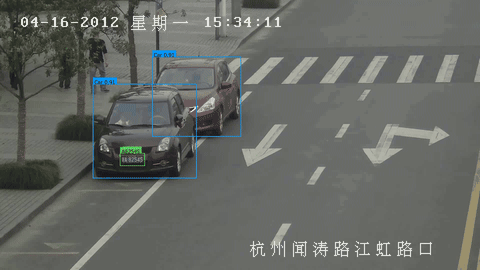

*Live output, unedited: vehicle detection, plate detection, and OCR running together on real footage — see [more in the notebooks section](#-notebooks--the-fastest-way-to-see-it-work).*

</div>

---

> ### 💼 Need production-grade accuracy on *your own* cameras?
> This repository is the **open, general-purpose core** — great for evaluation, learning and prototyping,
> and already solid on everyday traffic. It is **not** tuned to your specific cameras, lighting, distance,
> or plate mix. For a version **fine-tuned on your own footage** — noticeably higher accuracy, especially on
> crowded/far-field (highway) scenes — see [**Contact / Custom deployments**](#-contact--custom-deployments).

---

## The problem with every other open-source ALPR

They stop at `YOLO → OCR → print(text)`.

That pipeline hands you a *different string every frame*, has no idea whether the
string it just produced could even be a real plate, and only works for the one
country its author lives in.

PelakX adds the three layers that turn OCR output into information:

```
                    OCR says:  "12ب345I1"
                                   │
   ①  COUNTRY GRAMMAR  ────────────┤  Iran layout is DD-L-DDD-DD.
      Slot 6 must be a digit; "I" is not.                     ↓
      Confusion map repairs I→1 at a 6% confidence cost.   12ب34511  ✓ valid
                                   │
   ②  TEMPORAL FUSION  ────────────┤  frame 41: 12ب34511   frame 44: 12ب34521
      Weighted per-character vote     frame 47: 12ب34511   frame 52: 12ب94511
      across the whole tracklet.                            ↓
                                                   12ب34511  (97%, 4 votes)
                                   │
   ③  ANALYTICS  ──────────────────┤  speed · direction · line crossings ·
                                      watchlist · searchable SQLite
```

Layer ① is why a plate that *no single frame read correctly* still comes out right.

---

## 60-second quickstart

```bash
git clone https://github.com/ParsaVictor/pelakx-license-plate-detection.git
cd PelakX
pip install -e ".[detect,onnx]"     # add ",fa" for Persian, ",dash" for the dashboard
```

**See the grammar engine work with no models and no video:**

```bash
pelakx parse "۱۲ ب ۳۴۵ ایران ۱۱"
```

```
┌───────────────── input: ۱۲ ب ۳۴۵ ایران ۱۱ ─────────────────┐
│ 12 ب 345 | ایران 11                                        │
│                                                            │
│ canonical   12ب34511                                       │
│ country     IR   layout: civilian                          │
│ confidence  92.0%   (ocr 90%, 0 repairs)                   │
│ status      valid                                          │
│                                                            │
│ fields                                                     │
│   left       12                                            │
│   letter     ب        right      345                       │
│   province   11                                            │
└────────────────────────────────────────────────────────────┘
```

Persian-Indic digits folded, the printed word **ایران** stripped, the layout
matched, the province validated — all from a YAML file.

**Then run it on video:**

```bash
pelakx run traffic.mp4 --country IR          # Persian plates
pelakx run traffic.mp4 --country GB          # UK plates
pelakx run traffic.mp4 --country auto        # let PelakX work out the country
pelakx bench traffic.mp4                     # can this machine keep up? where does the time go?
pelakx search "12ب*"                         # query the results afterwards
pelakx dashboard                             # explore them visually
```

Prefer a notebook? [`notebooks/PelakX_Quickstart.ipynb`](notebooks/PelakX_Quickstart.ipynb)
walks through every layer with runnable cells — the first four sections need no
models and no video.

A real run on 131 frames of dashcam footage, **CPU only, no GPU**:

```
 frames processed           131
 throughput             8.2 fps
 vehicles tracked             3
 plate readings               8
 crops skipped by gate   0 (0%)

 track  plate           conf  class
     1  KL 09 AQ 3439    97%  motorcycle       ← country auto-detected as India
```

---

## 📓 Notebooks — the fastest way to see it work

No `pip install -e`, no CLI — open a notebook, run all cells, get an annotated
video + CSV of every plate read.

One pipeline, two languages — pick whichever you read faster:

| Notebook | Language | What it is |
|---|---|---|
| [`notebooks/license_plate_detection.ipynb`](notebooks/license_plate_detection.ipynb) | 🇬🇧 English | **Recommended.** Vehicle detection → plate detection → OCR → Iran-plate parsing, all in one runnable notebook. |
| [`notebooks/pelak.ipynb`](notebooks/pelak.ipynb) | 🇮🇷 فارسی | همان نوت‌بوک، همان کد، همان منطق — فقط راهنماها و خروجی‌ها به فارسی. |
| [`notebooks/PelakX_Quickstart.ipynb`](notebooks/PelakX_Quickstart.ipynb) | 🇬🇧 English | Walks through the full installable `pelakx` package above (grammar engine, temporal fusion, analytics) — a separate, more heavily-instrumented codebase. |

Both pipeline notebooks are **config-driven**: the vehicle detection model and
its input resolution are read from a YAML file ([`configs/`](configs)), with
four ready-made profiles from a quiet street to a highway camera — retune a
deployment for a new camera without touching a single line of code.

> **This is an early-access engineering demo**, not a finished commercial product.
> It already reads plates smartly and accurately on everyday traffic; far-field/highway
> accuracy and true production hardening (your cameras, your lighting, your exact
> plate mix) are exactly what a [custom deployment](#-contact--custom-deployments) is for.
> The same detection + OCR + parsing pipeline works for **any country's plates** —
> swap in an OCR model trained on that country's plates and the grammar layer
> follows.

### 🎬 See it in action

The animation at the very top of this page is this pipeline's real, unedited
output on real traffic footage — vehicle detection, plate detection and OCR,
all running together.

### 🧠 How the pipeline thinks — architecture at a glance

```mermaid
%%{init: {"flowchart": {"nodeSpacing": 24, "rankSpacing": 34, "curve": "basis"}, "themeVariables": {"fontSize": "13px"}}}%%
flowchart LR
    CFG["configs/*.yaml<br/>model + imgsz"] --> INIT["Load YOLO models<br/>+ OCR engines"]
    INIT --> LOOP{"Next<br/>frame?"}
    LOOP -->|no more| EXPORT["Write .mp4<br/>+ .csv"]

    LOOP -->|yes| VDET["Detect vehicles<br/>@ configured imgsz"]
    VDET --> PDET["Detect plate in crop<br/>(fixed default size)"]
    PDET --> PFOUND{"Plate<br/>found?"}
    PFOUND -->|no| LOOP
    PFOUND -->|yes| UPSCALE["Upscale if small<br/>(auto-scaled)"]

    UPSCALE --> MODE{"Country<br/>mode?"}
    MODE -->|IR| FA["Persian OCR<br/>Hezar CRNN"]
    MODE -->|GLOBAL| LAT["Latin OCR<br/>fast-plate-ocr"]
    MODE -->|AUTO| FA2["Persian OCR<br/>first"]
    FA2 --> VALID{"Valid IR<br/>plate?"}
    VALID -->|yes| FA
    VALID -->|no| LAT

    FA --> PARSE["Parse IR fields:<br/>province · type · colour"]
    LAT --> RAWTXT["Raw plate text"]

    PARSE --> TRACK["Match nearest<br/>existing track"]
    RAWTXT --> TRACK
    TRACK --> BETTER{"Higher<br/>confidence?"}
    BETTER -->|yes| KEEP["Update track's<br/>best reading"]
    BETTER -->|no| SKIP["Keep previous —<br/>no flicker"]
    KEEP --> DRAW["Draw box + label,<br/>write frame"]
    SKIP --> DRAW
    DRAW --> LOOP

    classDef cfg fill:#f3e8ff,stroke:#7c3aed,stroke-width:2px,color:#1e1b2e;
    classDef stage fill:#dbeafe,stroke:#2563eb,stroke-width:2px,color:#0f1729;
    classDef decision fill:#fee2e2,stroke:#dc2626,stroke-width:2px,color:#2a0a0a;
    classDef out fill:#dcfce7,stroke:#16a34a,stroke-width:2px,color:#052e16;
    class CFG,INIT cfg;
    class VDET,PDET,UPSCALE,FA,LAT,FA2,PARSE,RAWTXT,TRACK,KEEP,SKIP,DRAW stage;
    class LOOP,PFOUND,MODE,VALID,BETTER decision;
    class EXPORT out;
```

Every box above is a real function in the notebook — this is not a simplified
marketing diagram, it is the actual control flow of `process_video()`.

---

## What makes it different

| | Typical OSS ALPR | **PelakX** |
|---|---|---|
| Vehicle + plate detection | ✅ | ✅ YOLO26, CPU-optimised |
| OCR | one language | ✅ **Persian + Latin + any script**, per-country engine chain |
| Multi-country plate formats | ❌ | ✅ **12 grammars shipped**, add one with a YAML file |
| Believes the OCR blindly | ✅ 😬 | ❌ every read is validated against a real plate grammar |
| Fixes OCR confusions | ❌ | ✅ bounded, priced `O↔0`, `ك↔ک` repair |
| Result per frame or per vehicle | per frame (flickers) | ✅ **per vehicle**, character-level temporal vote |
| Wastes OCR on unreadable crops | ✅ | ❌ quality gate skips them (typically 40–70%) |
| Auto-detect issuing country | ❌ | ✅ `--country auto` across all 12 grammars |
| Speed estimation | pixels/frame 🙃 | ✅ homography-calibrated, or **not reported at all** |
| Right-to-left text on video | mojibake | ✅ reshaped + bidi, real glyphs |
| Privacy mode | ❌ | ✅ one flag: pixelated plates, salted-HMAC pseudonyms |
| Searchable output | CSV | ✅ CSV / JSONL / **SQLite + FTS5 full-text search** |
| Adding a language | fork & rewrite | ✅ a config file, or a ~40-line engine plugin |

---

## Countries shipped

| Code | Country | Script | Layouts | Preferred OCR | Plate-category analysis |
|---|---|---|---|---|---|
| `IR` | 🇮🇷 Iran | Arabic (Persian) | civilian · motorcycle · free-zone · free-zone temporary | `hezar_fa` | ✅ colour · letter → use · province code (full) |
| `GB` | 🇬🇧 United Kingdom | Latin | current · prefix | `fast_plate` | grammar only |
| `US` | 🇺🇸 United States | Latin | CA · NY · generic | `fast_plate` | grammar only |
| `DE` | 🇩🇪 Germany | Latin | standard | `fast_plate` | grammar only |
| `FR` | 🇫🇷 France | Latin | SIV · FNI | `fast_plate` | grammar only |
| `ES` | 🇪🇸 Spain | Latin | modern | `fast_plate` | grammar only |
| `IT` | 🇮🇹 Italy | Latin | modern | `fast_plate` | grammar only |
| `NL` | 🇳🇱 Netherlands | Latin | sidecode x · y · legacy | `fast_plate` | grammar only |
| `TR` | 🇹🇷 Türkiye | Latin | standard | `fast_plate` | grammar only |
| `IN` | 🇮🇳 India | Latin | standard · BH-series | `fast_plate` | grammar only |
| `BR` | 🇧🇷 Brazil | Latin | Mercosul · legacy | `fast_plate` | grammar only |
| `AE` | 🇦🇪 UAE | Latin | emirate + code | `fast_plate` | grammar only |

*"Plate-category analysis" = decoding a plate's colour/letter/region into taxi/government/police/province etc.
It is fully implemented for Iran as the reference; every other country validates against its grammar
(layout, alphabet, confusion repair, structural validators) and is ready for the same tables via a YAML PR.*

```bash
pelakx countries          # list them
pelakx countries IR       # layouts, letter meanings, engine chain
pelakx new-country PK     # scaffold your own
```

**One country or all of them.** Naming a country is the default and the cheaper
path — only that grammar is consulted. `--country auto` opts every one of the
12 into competing for each reading, and uses the OCR engine's own region guess
only to break ties. Prefer a fixed country whenever you know it: a tighter
alphabet means fewer ways for OCR to be wrong, which is worth more than the
compute it saves.

> Auto runs **one** OCR engine over every crop, so it works within a script
> (Latin plates across Europe), not across them. For a mixed-script site, run
> one pipeline per camera.

Grammars live in `configs/countries/*.yaml` and are also loaded from
`~/.pelakx/countries/` and `$PELAKX_COUNTRIES` — **a country PR touches no Python
at all.** → [docs/ADDING_A_COUNTRY.md](docs/ADDING_A_COUNTRY.md)

**Plate-category recognition (background colour → taxi/government/police/
diplomatic/etc., letter → special-use category, region-code → province/city)
is implemented today for Iran** — see the gallery below — as the reference
implementation of a pattern most countries share (a plate's colour and
special letters usually encode its use, and a code segment usually encodes
its issuing region). Nothing about `letter_semantics`/`province_codes`/the
colour classifier is Iran-specific in code; adding the same depth for another
country is a grammar-file PR (sourced colour/letter/region tables), not a new
subsystem.

---

## 🇮🇷 Iran license-plate types — quick reference

<!-- TODO: reserved section — a richer, image-backed version of this table is coming; content to be provided separately. -->
*A dedicated English reference table is coming soon. In the meantime, see the
[Persian plate-types table](#انواع-پلاک-ایران-که-تشخیص-داده-میشوند) near the
end of this page, and the annotated gallery in [Architecture](#architecture) above.*

---

## Architecture

Two-stage detection (find the vehicle, then look for a plate *inside* it) shrinks
the search area by ~95% and gives every plate an owner, which is what makes the
temporal vote and the Iran-specific enrichment below possible — a bare
`plate-detector → OCR` pipeline has no vehicle to attach any of this to.

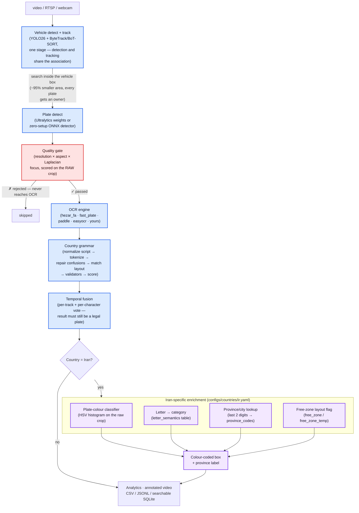

**Colour legend used on the annotated output** (see
[`src/pelakx/render/annotate.py`](src/pelakx/render/annotate.py) and
[`src/pelakx/grammar/plate_color.py`](src/pelakx/grammar/plate_color.py) —
every mapping below was checked against a real, photographed Iranian plate,
not guessed; sources cited in `configs/countries/ir.yaml`):

| Plate background / category | Box colour | Meaning |
|---|---|---|
| White | neutral (default) | Private / personal |
| Yellow | 🟧 orange | Taxi / public transport / commercial |
| Red | 🟥 red | Government / protocol |
| Green | 🟩 green | Police |
| Blue | 🟦 blue | Diplomatic / political |
| Brown | 🟫 brown | Historical / vintage (پلاک تاریخی) |
| Free-trade-zone (permanent or temporary) | 🟪 purple | Structurally different layout — flagged regardless of background colour |
| معلولین/جانباز letter slot | 🟦 cyan | Disabled / veteran |

### Iran plate categories, one by one

Every row below is either a real annotated frame this project actually produced
("Ours" — click through to reproduce it yourself in
[the notebook](notebooks/PelakX_Quickstart.ipynb)), or a reference plate photo
used to *verify* the category's real-world colour and letter before writing a
single line of code (credit: [nikbakhtkhodro.com](https://nikbakhtkhodro.com/%D8%A7%D9%86%D9%88%D8%A7%D8%B9-%D9%BE%D9%84%D8%A7%DA%A9-%D8%AE%D9%88%D8%AF%D8%B1%D9%88%D9%87%D8%A7-%D8%AF%D8%B1-%D8%A7%DB%8C%D8%B1%D8%A7%D9%86/), used here for illustration/education).

| | What it looks like | What the colour/letter means | Status |
|---|---|---|---|
| **Civilian (white)** | 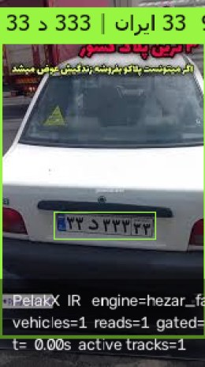 | White background, ordinary letter (ب/د/س/ص/ط/ق/ل/م/ن/و/ه/ی) → private vehicle, the overwhelming majority of plates. | ✅ Ours — full pipeline, real photo |
| **Free-trade-zone, temporary (پلاک موقت مناطق آزاد)** | 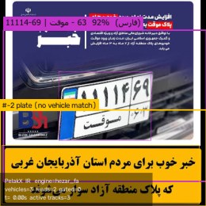 | Two printed lines (serial-sub over "موقت"-province); structurally different from every other layout, so it gets a purple box regardless of its actual background colour. | ✅ Ours — full pipeline, real photo |
| **Taxi** | 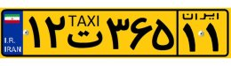 | Yellow background + letter ت. | ✅ Colour + letter logic implemented and verified against this reference photo — not yet confirmed on real moving-vehicle footage (none available yet) |
| **Government (دولتی)** | 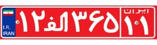 | Red background + letter الف. | ✅ same as above |
| **Police (پلیس)** | 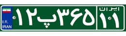 | Green background + letter پ. | ✅ same as above |
| **Diplomatic / political (سیاسی)** | 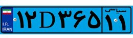 | Blue background + letter D. | ✅ same as above |
| **Historical / vintage (تاریخی)** | 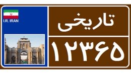 | Brown background; a *different* layout entirely (province name + code, not digit-letter-digit slots). | ⚠️ Colour classified; the layout itself is not parsed — known limitation |
| **Disabled / veteran (معلولین و جانبازان)** | 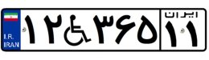 | White background; the letter slot is actually **ژ**, printed as a wheelchair pictogram rather than the glyph itself (per fa.wikipedia.org — this also explains why OCR sometimes misreads the icon as a stray letter). | ⚠️ Category logic verified correct against synthetic input; the OCR engine does not yet read the real pictogram — known limitation, see [docs/ARCHITECTURE.md](docs/ARCHITECTURE.md) |

Full write-up: [docs/ARCHITECTURE.md](docs/ARCHITECTURE.md) ·
Model choices and benchmarks: [docs/MODELS.md](docs/MODELS.md)

---

## Models

Everything is swappable; the defaults assume **CPU**, because that is where most
traffic cameras actually run.

| Stage | Default | Why |
|---|---|---|
| Vehicle | `yolo26n.pt` | Native end-to-end (no NMS), ~43% faster CPU ONNX than YOLO11n |
| Plate | `open-image-models` YOLOv9-t 384 end2end (ONNX) | Nothing to download by hand, ~5–10 ms CPU |
| OCR (Persian) | `hezarai/crnn-fa-license-plate-recognition-v2` | CRNN-CTC trained on Iranian plates specifically |
| OCR (Latin) | `fast-plate-ocr` `cct-xs-v2-global-model` | ONNX, ~13 ms CPU, 220k plates / 65+ countries |
| OCR (anything else) | PaddleOCR PP-OCRv5/v6 | One package, most scripts |
| Tracking | ByteTrack (`botsort.yaml` for heavy occlusion) | Identity switches destroy the temporal vote |

```bash
pelakx doctor        # what is installed, what is missing, and the exact fix
pelakx engines       # OCR engines and their availability
```

### Device selection

`device: auto` is the default and resolves at startup — **CUDA → MPS → CPU** —
so one config file runs on a workstation and on a fanless camera box. Override
with `--device cpu` / `--device cuda:1`, or globally with `PELAKX_DEVICE`.
`pelakx doctor` prints what it picked and why.

### Speed, measured rather than claimed

Vehicle detector only, 1280×720 footage, 8-core CPU, no GPU. 30 frames × 3
passes with the variants **interleaved frame by frame**, so background load
hits all of them equally; median reported.

| vehicle backbone | median ms | fps | vs baseline | avg detections |
|---|---|---|---|---|
| PyTorch, imgsz 640 | 111.9 | 8.9 | 1.00× | 7.7 |
| **ONNX, imgsz 640** | **75.7** | **13.2** | **1.48×** | 7.6 |
| PyTorch, imgsz 416 | 85.1 | 11.7 | 1.31× | 4.9 |
| **ONNX, imgsz 416** | **35.5** | **28.2** | **3.15×** | 5.0 |

Two things to read off that:

* **ONNX export is accuracy-neutral speed** — 1.48× at imgsz 640 with the same
  detections (7.6 vs 7.7 is noise). `pelakx export` does it in one command.
* **Dropping `imgsz` is not free** — 640 → 416 lost a third of the detections
  on this far-field footage. Measure it against *your* camera before shipping.

End-to-end on that scene: **5–7 fps** out of the box, **12–15 fps** with ONNX
plus `frame_stride: 2`. A 25 fps camera is comfortably handled at stride 2–3 —
sampling every frame of a vehicle that is in view for three seconds buys
nothing the temporal vote does not already have.

`pelakx bench <video>` prints this breakdown for your own footage and hardware.

---

## Privacy

License-plate systems *are* surveillance systems. One flag makes PelakX
privacy-preserving without turning it off:

```bash
pelakx run traffic.mp4 --privacy
```

* plates **pixelated** in the rendered video (resampling discards information —
  a Gaussian blur is a linear operator and is partially invertible)
* plate strings replaced by a **salted HMAC** pseudonym, so vehicles stay
  linkable across a deployment but are not re-identifiable without the salt
  (an unsalted SHA-256 of a plate is brute-forceable in seconds — that is not
  anonymisation)
* no crops written to disk

Counting, speed and watchlist matching all keep working.

---

## CLI

| command | what it does |
|---|---|
| `pelakx run <source>` | process a video / RTSP / webcam end to end |
| `pelakx parse <text>` | run the grammar engine on a string — no models needed |
| `pelakx bench <source>` | throughput + a per-stage millisecond breakdown |
| `pelakx export` | export the detector to ONNX (~25% faster on CPU, same accuracy) |
| `pelakx search <query>` | query a previous run's SQLite (`"12ب*"`, `--min-speed 90`) |
| `pelakx countries [CODE]` | list or inspect plate grammars |
| `pelakx engines` | OCR engines and whether they are installed |
| `pelakx doctor` | environment check with actionable fixes |
| `pelakx new-country XX` | scaffold a new country grammar |
| `pelakx download-models` | fetch optional plate-detection weights |
| `pelakx dashboard` | Streamlit dashboard over the results |

---

## Python API

```python
from pelakx import Pipeline, PipelineConfig

config = PipelineConfig(country="IR")
config.analytics.lines = {"north_gate": [[100, 500], [1180, 500]]}
config.analytics.watchlist = ["12ب34511", "34د*"]

pipeline = Pipeline(config)
summary = pipeline.run("traffic.mp4")

for event in summary.events:
    if event.plate:
        print(event.plate.display, event.plate.confidence, event.alerts)
```

Or drive the loop yourself:

```python
for frame, finished in pipeline.stream("rtsp://camera/stream"):
    cv2.imshow("PelakX", frame)
    for event in finished:
        push_to_my_system(event.to_row())
```

---

## Configuration

Every knob lives in one YAML file — [`configs/default.yaml`](configs/default.yaml)
documents all of them with defaults.

```bash
pelakx run traffic.mp4 --config configs/default.yaml --country IR
```

The three settings that matter most on CPU, in order: `frame_stride`,
`quality.min_score`, `ocr.early_stop_confidence`. The run summary prints exactly
how many crops the gate skipped so you can tune it against your own footage.

---

## Development

```bash
pip install -e ".[dev,detect,onnx]"
pytest -q                    # 78 tests, no models or weights required
ruff check src tests
```

The grammar, fusion, analytics, privacy, config and store layers have **zero ML
dependencies**, so the majority of the suite runs in about a second.

---

## Roadmap

- [x] **v0.1** — grammar engine, 12 countries, end-to-end pipeline, CLI, analytics, privacy, dashboard
- [ ] **v0.2** — Persian plate benchmark suite + published accuracy numbers
- [ ] **v0.3** — multi-camera / multi-stream orchestration, re-identification across cameras
- [ ] **v0.4** — ONNX/OpenVINO export path and an edge deployment profile
- [ ] **v0.5** — REST API + Docker image
- [ ] **v1.0** — 25+ country grammars, community engine plugins

---

## Contributing

The highest-value contribution is **your country's grammar**. It is a YAML file
and a test — no Python.
See [docs/ADDING_A_COUNTRY.md](docs/ADDING_A_COUNTRY.md).

Second highest: OCR confusion pairs you actually observed in your own footage.
Those are worth more than any model swap.

---

## 📞 Contact / Custom deployments

Everything in this repository — the `pelakx` package and the [demo notebooks](#-notebooks--the-fastest-way-to-see-it-work) — is the **open, general-purpose baseline**. It is tuned to work well out of the box, not tuned to *your* cameras, lighting, distance, or plate mix.

Get in touch if you need:

- higher accuracy on **crowded / far-field (highway) footage**
- a model **fine-tuned on your own recorded footage**
- integration into an existing system (dashboard, API, alerts, watchlists)
- ongoing support and maintenance

| | |
|---|---|
| 📧 Email | [1.parsa.karkooti@gmail.com](mailto:1.parsa.karkooti@gmail.com) |
| 💬 Telegram | [@Parsa_Karkooti](https://t.me/Parsa_Karkooti) |
| 🐙 GitHub | [@ParsaVictor](https://github.com/ParsaVictor) — or open an [issue](../../issues) / [discussion](../../discussions) on this repo |

---

## Acknowledgements

Built on [Ultralytics YOLO](https://github.com/ultralytics/ultralytics),
[fast-plate-ocr](https://github.com/ankandrew/fast-plate-ocr) and
[open-image-models](https://github.com/ankandrew/open-image-models),
[Hezar](https://github.com/hezarai/hezar), [PaddleOCR](https://github.com/PaddlePaddle/PaddleOCR)
and OpenCV. PelakX ships **no model weights** — every model is fetched from its
own upstream under its own licence.

---

## 🇮🇷 معرفی کامل — به فارسی

**پلاک‌ایکس (PelakX)** یک سیستم هوشمند تشخیص و تحلیل پلاک خودروست که از یک ویدیوی خام (دوربین ترافیکی، دش‌کم، یا هر منبع ویدیویی دیگر) خروجی قابل‌استفاده و جست‌وجوپذیر می‌سازد: هر خودرو را تشخیص می‌دهد، ردیابی می‌کند، پلاکش را در اسکریپت درست (فارسی یا لاتین) می‌خواند، و برخلاف اغلب ابزارهای مشابه، خروجی OCR را کورکورانه قبول نمی‌کند — آن را با گرامر واقعی پلاک همان کشور می‌سنجد تا فقط خوانش‌های معتبر و قابل‌اعتماد باقی بمانند.

### چرا این پروژه هوشمند و دقیق است

- **تشخیص دومرحله‌ای**: ابتدا خودرو پیدا می‌شود، بعد پلاک *داخل* همان خودرو جست‌وجو می‌شود — این کار محدوده‌ی جست‌وجو را حدود ۹۵٪ کوچک‌تر می‌کند و باعث می‌شود هر پلاک صاحب مشخصی (یک خودرو) داشته باشد، دقیقاً همان چیزی که رأی‌گیری زمانی (temporal vote) و تحلیل‌های بعدی را ممکن می‌کند.
- **رأی‌گیری روی کل ردیابی، نه یک فریم تنها**: به‌جای اعتماد به یک خوانش تصادفی از یک فریم، سیستم چند خوانش از فریم‌های مختلف یک خودرو را می‌بیند و قوی‌ترین/باثبات‌ترین نتیجه را نگه می‌دارد — متن پلاک روی ویدیو پرش نمی‌کند.
- **پارامترهای قابل‌تنظیم بدون دست‌زدن به کد**: مدل تشخیص خودرو و اندازه‌ی تصویر ورودی از یک فایل کانفیگ خوانده می‌شوند؛ همین یک تغییر، پروژه را از یک خیابان خلوت تا یک بزرگراه شلوغ قابل‌تنظیم می‌کند — و یک پارامتر سوم (آستانه‌ی بزرگ‌نمایی قبل از OCR) به‌طور کاملاً خودکار و متناسب با آن محاسبه می‌شود، بدون این‌که کیفیت OCR فدا شود.
- **مستقل از کشور و زبان، در سطح معماری**: هسته‌ی تشخیص (YOLO) و لایه‌ی OCR کاملاً از هم جدا هستند. یعنی این پایپ‌لاین به‌طور ذاتی محدود به ایران نیست — برای هر کشوری که یک مدل OCR مناسب پلاک‌های همان کشور در اختیار داشته باشیم، همین معماری با کمی تنظیم قابل استفاده است. پکیج کامل `pelakx` (کنار همین نوت‌بوک‌ها) همین امروز ۱۲ گرامر کشور را از قبل پیاده‌سازی کرده.
- **پشتیبانی عمیق از پلاک ایران**: خواندن ارقام و حرف، تشخیص کد دورقمی استان، تشخیص رنگ زمینه‌ی پلاک (سفید/زرد/قرمز/سبز/آبی)، تشخیص نوع پلاک از روی حرف (شخصی/تاکسی/دولتی/پلیس/دیپلمات/کشاورزی/معلولین‌وجانبازان/گذر موقت)، و تشخیص چیدمان پلاک موقت مناطق آزاد.

### وضعیت فعلی و صداقت درباره‌ی محدودیت‌ها

این ریپازیتوری یک **دموی مهندسی در دسترس عموم** است، نه یک محصول نهایی تجاری. روی ترافیک معمولی و خیابان‌های خلوت تا نیمه‌شلوغ، خروجی دقیق و باثبات است. روی صحنه‌های خیلی شلوغ یا پلاک‌های خیلی دور (بزرگراه)، دقت افت می‌کند — این یک محدودیت شناخته‌شده است، نه یک باگ پنهان، و دقیقاً همان‌جایی‌ست که یک نسخه‌ی **فاین‌تیون‌شده روی فوتیج واقعی مشتری** تفاوت واقعی ایجاد می‌کند.

به همین ترتیب، تشخیص رنگ/نوع پلاک ایران از نظر منطق کامل و مبتنی بر منابع واقعی است، اما دقتِ خودِ تشخیص رنگ (که بر پایه‌ی آستانه‌های HSV کار می‌کند) هنوز روی تنوع کامل نور/زاویه‌ی دوربین‌های واقعی سنجیده نشده — چیزی که در یک استقرار سفارشی، برای دوربین‌های واقعی مشتری کالیبره و تضمین می‌شود.

### انواع پلاک ایران که تشخیص داده می‌شوند

هر ردیف زیر یا یک فریم واقعی است که خودِ این پروژه تولید کرده («مال ما» — با اجرای کامل پایپ‌لاین روی [نوت‌بوک](notebooks/pelak.ipynb) قابل بازتولید است)، یا یک عکس مرجع است که پیش از نوشتن حتی یک خط کد، برای تأیید رنگ و حرف واقعی همان دسته استفاده شده (منبع: [nikbakhtkhodro.com](https://nikbakhtkhodro.com/%D8%A7%D9%86%D9%88%D8%A7%D8%B9-%D9%BE%D9%84%D8%A7%DA%A9-%D8%AE%D9%88%D8%AF%D8%B1%D9%88%D9%87%D8%A7-%D8%AF%D8%B1-%D8%A7%DB%8C%D8%B1%D8%A7%D9%86/)، فقط برای نمایش/آموزش).

| | تصویر | معنای رنگ/حرف | وضعیت |
|---|---|---|---|
| **شخصی (سفید)** |  | زمینه‌ی سفید، حرف عادی (ب/د/س/ص/ط/ق/ل/م/ن/و/ه/ی) ← خودروی شخصی، اکثریت قریب‌به‌اتفاق پلاک‌های جاده. | ✅ مال ما — پایپ‌لاین کامل، عکس واقعی |
| **گذر موقت مناطق آزاد** |  | دو خط چاپی (سریال روی «موقت»-استان)؛ چیدمانش کاملاً با بقیه فرق دارد، پس صرف‌نظر از رنگ واقعی‌اش جعبه‌ی بنفش می‌گیرد. | ✅ مال ما — پایپ‌لاین کامل، عکس واقعی |
| **تاکسی** |  | زمینه‌ی زرد + حرف ت. | ✅ منطق رنگ+حرف پیاده و روی همین عکس مرجع تأیید شده — هنوز روی فوتیج واقعیِ در حرکت تست نشده (فعلاً در دسترس نبوده) |
| **دولتی** |  | زمینه‌ی قرمز + حرف الف. | ✅ مشابه بالا |
| **پلیس** |  | زمینه‌ی سبز + حرف پ. | ✅ مشابه بالا |
| **دیپلمات/سیاسی** |  | زمینه‌ی آبی + حرف D. | ✅ مشابه بالا |
| **تاریخی (پلاک قهوه‌ای)** |  | زمینه‌ی قهوه‌ای؛ چیدمانش کاملاً *متفاوت* است (نام استان + کد، نه جایگاه‌های رقم-حرف-رقم). | ⚠️ رنگ تشخیص داده می‌شود؛ خودِ چیدمان هنوز پارس نمی‌شود — محدودیت شناخته‌شده |
| **معلولین و جانبازان** |  | زمینه‌ی سفید؛ جایگاه حرف در واقع **ژ** است که به‌صورت آیکون ویلچر چاپ می‌شود نه خودِ حرف (طبق fa.wikipedia.org — همین هم دلیل اشتباه‌خوانی گاه‌به‌گاه OCR است). | ⚠️ منطق دسته‌بندی روی ورودی مصنوعی تأیید شده؛ موتور OCR هنوز خودِ آیکون واقعی را نمی‌خواند — محدودیت شناخته‌شده |

توضیح: منطق حرف‌های «ماشین‌آلات کشاورزی» (ک، زرد) و «گذر موقت غیرمنطقه‌آزاد» (گ، سفید) هم در کد پیاده‌سازی شده، ولی هنوز عکس نمونه‌ی مرجع/واقعی برایشان در این جدول نداریم.

### جمع‌بندی

اگر به‌دنبال یک نقطه‌ی شروع قوی، شفاف و قابل‌اعتماد برای تشخیص پلاک هستید — این پروژه دقیقاً همان است. اگر به‌دنبال دقت production-grade روی دوربین‌های خودتان هستید، از بخش [تماس با ما](#-contact--custom-deployments) پیام بدهید.

## License

MIT — see [LICENSE](LICENSE).
